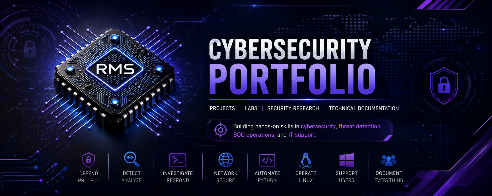

# Cybersecurity Portfolio

Welcome. I’m **Ryan Mihalics-Shaw**, a cybersecurity student and IT support/security candidate building hands-on skills in SOC analysis, Python log analysis, Linux, networking, Wireshark, technical documentation, and blue-team fundamentals.

This repository serves as my central cybersecurity portfolio. It includes projects, labs, writeups, and learning milestones as I continue preparing for roles in IT support, technical support, NOC, SOC Tier 1, and security support.

## Recruiter Snapshot

* Cybersecurity student focused on practical blue-team and IT support skills
* Per Scholas IT/Security graduate
* Building toward SOC Analyst, NOC Technician, and security support roles
* Hands-on practice with Python, Linux, networking, Wireshark, log analysis, and documentation
* Strong background in customer-facing service, communication, troubleshooting, and fast-paced problem solving

## Current Focus

I am currently focused on developing job-ready skills in:

* SOC operations and alert triage
* Python scripting for cybersecurity tasks
* Linux command line and system fundamentals
* Networking fundamentals
* Wireshark packet analysis
* Log analysis and documentation
* MITRE ATT&CK fundamentals
* Blue-team and purple-team security concepts
* Technical support and troubleshooting workflows

## Technical Skills

* Python scripting
* Linux command line
* Networking fundamentals, including DNS, DHCP, TCP/IP, and troubleshooting
* Wireshark packet analysis
* Active Directory basics
* Microsoft 365 support
* Virtual machines and lab environments
* Log analysis and alert triage
* Security documentation
* Incident response fundamentals
* Technical support documentation

## Featured Work

### Python Log Analyzer

A Python-based cybersecurity project that analyzes sample authentication logs, identifies suspicious login activity, and generates a SOC-style findings summary.

**Repository:** [python-log-analyzer](https://github.com/CyberSecRYAN/python-log-analyzer)

**Skills demonstrated:**

* Python scripting
* Log analysis
* Detection logic
* Regular expressions
* Security documentation
* SOC-style findings
* Technical troubleshooting

### Purple Team Cybersecurity Journey

A hands-on learning repository documenting my growth in SOC analysis, threat detection, log analysis, Linux, networking, Python, and purple-team fundamentals.

**Repository:** [purple-team-journey](https://github.com/CyberSecRYAN/purple-team-journey)

**Skills demonstrated:**

* SOC learning documentation
* Threat detection fundamentals
* Python log analysis practice
* Linux and networking practice
* Blue-team and purple-team learning structure

### Practice Security Audit Writeup

A sample security audit exercise focused on identifying common security weaknesses and recommending practical remediation steps.

**Key findings included:**

* Weak password policy
* Lack of multi-factor authentication
* Unpatched software vulnerabilities
* Need for improved identity and access controls
* Need for clearer security documentation

**Skills demonstrated:**

* Risk identification
* Security control recommendations
* Technical writing
* Basic audit structure
* Remediation planning

## Project Roadmap

| Project                       | Focus Area                                   | Status             |
| ----------------------------- | -------------------------------------------- | ------------------ |
| Python Log Analyzer           | Python, log analysis, detection logic        | Version 1 complete |
| Wireshark Packet Analysis Lab | Networking, packet inspection, documentation | Planned            |
| Linux Hardening Notes         | Linux security fundamentals                  | Planned            |
| Incident Response Notes       | SOC documentation and response process       | Planned            |
| Active Directory Home Lab     | Windows, identity, access management         | Planned            |

## Career Goals

I am building toward roles such as:

* IT Support Specialist
* Help Desk Technician
* Technical Support Specialist
* NOC Technician
* Tier 1 SOC Analyst
* Security Support Analyst

My goal is to combine strong IT support fundamentals with hands-on cybersecurity practice, clear documentation, and a continuous learning mindset.

## Connect With Me

* **LinkedIn:** [linkedin.com/in/cyberotto](https://www.linkedin.com/in/cyberotto)
* **GitHub:** [github.com/CyberSecRYAN](https://github.com/CyberSecRYAN)
* **Email:** [ryanmshaw@proton.me](mailto:ryanmshaw@proton.me)
